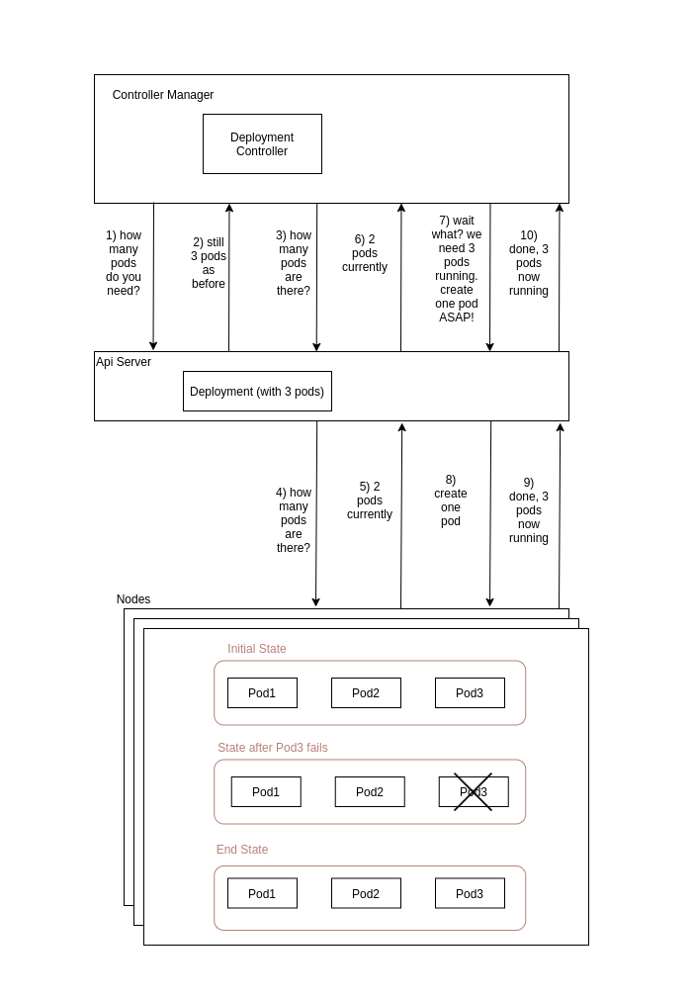
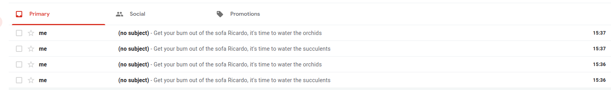

# k8s-wateringalarm-operator

This repo is a step by step approach to creating a kubernetes operator following a natural self discovery path. The end goal here is to create a bad ass operator!

## Requirements:

Minikube v1.20  
Kubectl v1.21


# WTF is an Operator? I mean, for real! A discovery journey.

What is a Kubernetes operator? People at the office keep talking about it. There are a few concepts I hear that make sense. I hear it takes advantage of Kubernetes control-loop. The control-loop is a mechanism by which Kubernetes compares a desired state of the world with the real state of the world. Take for instance a deployment with 3 pod replicas. Whenever I manually destroy a pod in my local Minikube cluster, another one will be spun off if that pod. Here, initially, the desired state of the world matched the real state of the world, ie, 3 pods. However, once I destroy a pod, the real state of the world is now only 2 pods. As such, the control loop needs to reconcile this mismatch between what is desired and what is real. Now, this concept is implemented via a Kubernetes component called the Deployment Controller. This controller watches for any changes both on the resource specifications and on the cluster deployed resources. This is it! Ignoring for now the role of the ReplicaSet controller, the Deployment controller informs the scheduler that it needs to assign a new pod to a suitable node. The scheduler then lets the api server know which kubelet it has to instruct to create a new pod.

This is a bit intense. Maybe a simple drawing would help clear it out. Please note that many details are overlooked in this depiction.



Diagram 1. Deployment Chain Reaction


I don't know how this deployment controller is implemented, but I think that maybe I could create one myself. This is a big challenge. Where shall I put it? 

## Iteration 1 

I will create a script which will watch for any updates on the number of pods wanted. Let's use a Nginx webserver image for simplicity. Now, how will the watcher know where to look for the information on the number of pods wanted? Configmaps are used to pass information around, so maybe I can use that. I will create a sample configmap yaml which will convey the number of Nginx replicas that I want. 

```yaml
apiVersion: v1
kind: ConfigMap
metadata:
  name: ricardosdeployment
data:
  ricardosReplicas: "3" 
```

Awesome stuff, now that I have the piece of information that I want and the transmission vessel, let's get onto the script. I will use `bash` as I need to use `kubectl` and I'm not particularly familiar with language specific [Kubernetes client libraries](https://kubernetes.io/docs/reference/using-api/client-libraries/). 

I need to start the script by telling the api server to look for new configmaps, as well as updates and deletions. 

`iteration-1/operator.sh`
```bash
kubectl get --watch --output-watch-events configmap -o=custom-columns=TYPE:type,NAME:object.metadata.name,REPLICAS:object.data.ricardosReplicas 
```

With two terminals open, I can run the above `kubectl` command in one and then I can apply the `sample-configmap.yml` on the other one. On the former, I see it delivers a table in our familiar `kubectl` output format and there it is, a line which states that the configmap regarding ricardosdeployment was added to the configmap resources.

```bash
TYPE    NAME               REPLICAS
ADDED   kube-root-ca.crt   <none>
ADDED   ricardosdeployment   3
```

This is great. I now want to transpose this information to a replicaset which will create or delete pods in order to make my wishes come true.

To do so, we will add a few lines to the script which will fetch the pieces of data we care about and store them in the variables EVENT, NAME and REPLICAS. With such information, whenever an EVENT takes place to any configmap, for instance whenever I modify the number of replicas from 3 to 2, this script will run and will apply the changes to the real world via a heredoc. If the replicaset already exists it will be updated or deleted. If it doesn't it will be created. 

`iteration-1/operator.sh`
```bash
kubectl get --watch --output-watch-events configmap -o=custom-columns=TYPE:type,NAME:object.metadata.name,REPLICAS=object.data.ricardoReplicas --no-headers | \
	while read next; do
    EVENT=$(echo $next | cut -d' ' -f1)
    NAME=$(echo $next | cut -d' ' -f2)
    REPLICAS=$(echo $next | cut -d' ' -f3)
	
		case $EVENT in
                  ADDED|MODIFIED)
			  kubectl apply -f - << EOF
apiVersion: apps/v1
kind: ReplicaSet
metadata:
  name: $NAME
  labels:
    app: $NAME
spec:
  replicas: $REPLICAS
  selector:
    matchLabels:
      app: $NAME
  template:
    metadata:
      labels:
        app: $NAME
    spec:
      containers:
      - name: nginx-webserver
        image: nginx

EOF
			   ;;
					DELETED)
                    kubectl delete replicaset $NAME
                    ;;
          esac
done
``` 


Let's test our baby.  We start by opening three terminal windows. Then, in window 1 let's run the operator:  
```bash
$ bash iteration-1/operator.sh
```     
      
Oops!  What's this?
```bash 
The connection to the server localhost:8080 was refused - did you specify the right host or port?
```
In this case, we get this error because we aren't linked to any Kubernetes cluster. We forgot to start minikube. Easy, let's run it (from any location):   
```bash
$ minikube start
``` 

This command automatically sets `kubectl` config file to point to Minikube's cluster. We run the `bash` command again. Sweet! The operator is running. Now, all we need is to create a configmap with the appropriate format. On window 2 let's create a configmap using our `sample-configmap.yml`. We get:

```bash
$ kubectl apply -f iteration-1/sample-configmap.yml
configmap/ricardosdeployment created
```
Nice! Let's check whether a replicaset was created and how many replicas it displays.  


```bash
$ kubectl get replicasets
NAME                 DESIRED   CURRENT   READY   AGE
kube-root-ca.crt     1         1         1       12m
ricardosdeployment   3         3         3       10s
```
Booyakasha! We've got a replicaset with 3 pods desired and running! Out of curiosity let's see each of the pods.


```bash
$ kubectl get pods
NAME                       READY   STATUS    RESTARTS   AGE
kube-root-ca.crt-7twj5     1/1     Running   0          12m
ricardosdeployment-5ds8m   1/1     Running   0          25s
ricardosdeployment-h87tq   1/1     Running   0          25s
ricardosdeployment-nls2b   1/1     Running   0          25s

```

Bazinga! Let's update our `sample-configmap.yml` to the have only two replicas instead of three. 

```yaml
apiVersion: v1
kind: ConfigMap
metadata:
  name: ricardosdeployment
data:
  ricardosReplicas: "2" //changed from "3" 
```

Apply that file and check how many pods we have now


```bash
$ kubectl apply -f iteration-1/sample-configmap.yml
NAME                       READY   STATUS        RESTARTS   AGE
kube-root-ca.crt-7twj5     1/1     Running       0          15m
ricardosdeployment-5ds8m   1/1     Running       0          3m17s
ricardosdeployment-h87tq   1/1     Running       0          3m17s
ricardosdeployment-nls2b   0/1     Terminating   0          3m17s
```
Victory! One of the three pods is terminating which will leave us with two pods running just as expected.


## Iteration 2


Using an existing Kubernetes resources like a configMmp is cool. However I can already see a problem. If I were to create a configmap with any other purpose, it would still be picked up by our operator and unpredictable behaviour could follow. In particular, it is easy to imagine unwanted replicasets and pods being created. 

What we really need to do is to create our own custom resource, so that our operator only pays atention to it. 

I could create a new **Custom Resource Definition (CRD)** which would define this new type of resource. I could now create RicardosConfigMaps for instance. But wait, while I can feel that this is powerful I still don't get how can I use this to my advantage. All I learnt is that an operator and a custom resource can take care of making sure the number of pods running match what I want. There must be more tasks I can automate, no? Indeed there are! What I came to realise is that I can apply this same rationale to any other type of resources and tasks. What resource and tasks would be simple and useful?


I love plants. I have many plants. I forget to water them when I should. They die. I get sad. I need to address this so that I can get my life in order. Could a Kubernetes Watering Alarm Custom Resource come to the rescue? Just to make it clear, there is not Kubernetes Watering Alarm. I will have to create this type of resource by creating the aforementioned CustomResourceDefinition.

I start by creating a CRD. Below is the full yaml

```yaml
apiVersion: apiextensions.k8s.io/v1
kind: CustomResourceDefinition
metadata:
  name: wateringalarms.ric.com
spec:
  group: ric.com
  names:
    kind: WateringAlarm
    plural: wateringalarms
    listKind: WateringAlarmList
    singular: wateringalarm
  scope: Namespaced
  versions:
  - name: v1
    served: true
    storage: true
    schema:
      openAPIV3Schema:
        type: object
        properties:
          spec:
            type: object
            properties:
              plant:
                type: string
                description: Type of plant
              timeinterval:
                type: integer
                description: Interval between watering
    additionalPrinterColumns:
      - name: Plant
        jsonPath: .spec.plant
        type: string
      - name: TimeInterval
        jsonPath: .spec.timeinterval
        type: string
      - name: Age
        jsonPath: .metadata.creationTimestamp
        type: date
```

Custom Resource Definitions let the Kubernetes Api Server know what properties custom resources have. In this case, a WateringAlarm will have two base properties: `plant` which states the type of plant this alarm refers to and `timeinterval` which states the time interval in days between waterings.


Let's deploy it:
```bash
$ kubectl apply -f iteration-2/wateringalarm-crd.yml
NAME              SHORTNAMES   APIVERSION     NAMESPACED   KIND

...

wateringalarms                 ric.com/       true         WateringAlarm

...
```

Boom! We have a new CRD. Check `$ kubectl api-resources` to double check we have `wateringalarms` as a new api resource. 


All custom resource definitions can also be listed with `$ kubectl get crds`.

```bash
NAME                     CREATED AT
wateringalarms.ric.com   2021-06-17T13:29:57Z
```

Now, we can go ahead and create custom resources of type WateringAlarm. In this case we will build alarms for orchids and succulents. 

`iteration-1/orchid-wateringalarm.yml`
```yaml
apiVersion: "ric.com/v1"
kind: WateringAlarm
metadata:
  name: orchid-wateringalarm
spec:
  plant: orchid
  timeinterval: 7
```
and

`iteration-1/succulent-wateringalarm.yml`
```yaml
apiVersion: "ric.com/v1"
  kind: WateringAlarm
  metadata:
    name: succulent-wateringalarm
  spec:
    plant: succulent
    timeinterval: 5

```
These reflect the fact that succulents need watering every five days while orchids once a week. Now, I create these resources:

```bash
$ kubectl apply -f iteration-2/orchid-wateringalarm.yml \
       && kubectl apply -f iteration-2/succulent-wateringalarm.yml
```

And let's check what happens when:

```bash
$ kubectl get wateringalarms
NAME                      PLANT       TIMEINTERVAL   AGE
orchid-wateringalarm      orchid      7              12s
succulent-wateringalarm   succulent   5              12s
```

Neat!

Now hat I have the resources created, how do I take advantage of the operator pattern to leverage them? Easy, same as before:
1. Create a watcher on the operator
2. Do something when the the watcher identifies a change

This is exactly the same as on iteration-1, now with my beautiful custom resource. Let's look at the operator.

`iteration-2/operator.sh`

```bash
#!/usr/bin/env bash

kubectl get --watch --output-watch-events wateringalarm \
-o=custom-columns=type:type,name:object.metadata.name,plant:object.spec.plant,timeinterval:object.spec.timeinterval --no-headers	| \
	while read next; do
		PLANT=$(echo $next | cut -d' ' -f3)
    EVENT=$(echo $next | cut -d' ' -f1)
	  TIMEINTERVAL=$(echo $next | cut -d' ' -f4)
		case $EVENT in
                  ADDED|MODIFIED)
        kubectl apply -f - << EOF
apiVersion: v1
data:
  revaliases: "# sSMTP aliases\n# \n# Format:\tlocal_account:outgoing_address:mailhub\n#\n#
    Example: root:your_login@your.domain:mailhub.your.domain[:port]\n# where [:port]
    is an optional port number that defaults to 25.\n\nroot:<YOUR-GMAIL-USERNAME>@gmail.com:smtp.gmail.com:587\n"
  ssmtp.conf: "#\n# Config file for sSMTP sendmail\n#\n# The person who gets all mail
    for userids < 1000\n# Make this empty to disable rewriting.\nroot=<YOUR-GMAIL-USERNAME>@gmail.com\n\n#
    The place where the mail goes. The actual machine name is required no \n# MX records
    are consulted. Commonly mailhosts are named mail.domain.com\n#mailhub=mail\nmailhub=smtp.gmail.com:587\n\nAuthUser=<YOUR-GMAIL-USERNAME>@gmail.com\nAuthPass=<YOUR-GMAIL-PASSWORD>\nUseTLS=YES\nUseSTARTTLS=YES\n\n#
    Where will the mail seem to come from?\n#rewriteDomain=\nrewriteDomain=gmail.com\n\n#
    The full hostname\n#hostname=ric-ThinkPad-X1-Carbon-6th\n#hostname=<YOUR-GMAIL-USERNAME>@gmail.com\nhostname=localhost\n\n#
    Are users allowed to set their own From: address?\n# YES - Allow the user to specify
    their own From: address\n# NO - Use the system generated From: address\nFromLineOverride=YES\n\n"
kind: ConfigMap
metadata:
  creationTimestamp: null
  name: ssmtp-conf

EOF

			  kubectl apply -f - << EOF
apiVersion: batch/v1beta1
kind: CronJob
metadata:
  name: $PLANT
spec:
  jobTemplate:
    metadata:
      name: $PLANT
    spec:
      backoffLimit: 5
      activeDeadlineSeconds: 30
      template:
        spec:
          restartPolicy: Never
          containers:
          - image: ubuntu
            name: $PLANT
            command:
            - /bin/sh
            - -c
            - apt-get update && apt-get --assume-yes install ssmtp && cp /etc/ssmtp-temp/ssmtp.conf /etc/ssmtp/ssmtp.conf && cp /etc/ssmtp-temp/revaliases /etc/ssmtp/revaliases.conf && echo "Get your bum out of the sofa Ricardo, it's time to water the ${PLANT}s" | ssmtp <YOUR-GMAIL-USERNAME>@gmail.com
            volumeMounts:
            - name: ssmtp-conf
              mountPath: /etc/ssmtp-temp
          volumes:
            - name: ssmtp-conf
              configMap:
                name: ssmtp-conf
  schedule: "0 0 */$TIMEINTERVAL * *"

EOF
			   ;;
					DELETED)
                    kubectl delete cronjob $PLANT
                    kubectl delete configmap ssmtp-conf
                    ;;
          esac
done

```
This is a more intense file. However, the principles are the same.
There is a watcher and there is stuff that is done whenever a custom resource is created, updated or deleted. The custom resource here refers to a WateringAlarm. The stuff that is done refers to the creation, update or deletion of a configmap and a cronjob. Any time a a WateringAlarm is created or updated the watcher deploys or updates a cronjob which will be triggered every time the `timeinterval` defined in the WateringAlarm runs out. It deletes the cronjob whenever a WateringAlarm resource is deleted. 

Since I need the container created by the cronjob to notify me somehow, I decided to use my Gmail account as an email server. In order to send me an email reminding me about watering the plants, I used an ubuntu image and installed ssmpt. There is a bunch of configuration required for the email protocol. See this [link](https://www.havetheknowhow.com/Configure-the-server/Install-ssmtp.html). Following that link, I created a configmap from the files `/etc/ssmtp/revaliases` and ` /etc/ssmtp/ssmtp.conf` and pasted it on the `iteration-2/operator.sh` file with the name `ssmtp-conf`. In other words, these files were mounted on the containter via the configmap.

As before, let's run the operator:
```bash
$ bash iteration-2/operator.sh
```

Ok, but I don't want to wait five days to check whether this is working. I don't want to wait one day for that matter. I want to know now if this works. To check it straight away we can do a small hack on the operator. Simply replace the line with the cronjob schedule 
```yaml

 schedule: "0 0 */$TIMEINTERVAL * *"

```

with

```yaml
 schedule: "* * * * *"

```

This cronjob will run every minute and as such in one minute or so I should have my warning message in my inbox. After running the `iteration-2/operator.sh` file again, let's check our email.




Sweet lord, my watering alarms are working and my operator is making sure any creation, update or deletion of a WateringAlarm is reconciled with reality! To be more specific, if I realize my cactus need watering once a month, after I create the cactus-wateringalarm custom resource, the operator will create a cronjob that will spin up a pod which sends me a friendly email reminder to water my cacti.

Operators are a blast! What else can I do? I've been using bash to write them, but I reckon I can write them in other languages. To be honest there must some frameworks that make this entire endeavour even simpler. I hear stuff about Operator SDK in Go as well as Kubebuilder. Also, it would be nice to use an operator to help me in some of the more mundane tasks I do as a software developer, such as spinning new databases.

Let's continue our discoveries together on the next parts of this journey.

/////////////////////////////////////////////////////////////////////////////////

//////////////////////////////////END OF PART 1//////////////////////////////////

/////////////////////////////////////////////////////////////////////////////////

TODO -------------- For the credentials I used a secret. IF HAVE TIME REVISE THIS LAST BIT

## Iteration 3 (to be confirmed)
Same as iteration 2 but to implement a mysql database

## Iteration 4

Bash is nice, but I hear Kubernetes is written in Go. Can I write an operator in Go?

--- USE GO SDK

## Iteration 5

My friend told me he used *Kubebuilder* to scaffold his operator. Shall we try? 
First think, we have to install kubebuilder and Kustomize. Why both?

I am starting the project by initializating an empty project. I used iteration5/ as the root of the project.

`go mod init wateringalarm`

The above command creates the go.mod file which will contain the project dependencies among other details.

Then I initialize the project. 

`kubebuilder init --domain ricardoptcosta.github.io`

At this point I have the following folder structure:

	.
	├── bin
	│   └── manager
	├── config
	│   ├── certmanager
	│   ├── default
	│   ├── manager
	│   ├── prometheus
	│   ├── rbac
	│   └── webhook
	├── Dockerfile
	├── go.mod
	├── go.sum
	├── hack
	│   └── boilerplate.go.txt
	├── main.go
	├── Makefile
	└── PROJECT

Then I ask Kubebuilder to scaffold a Kubernetes API by creating a Custom Resource Definition and the Controller.

`kubebuilder create api --resource --controller --group alarm --version v1alpha1 --kind WateringAlarm `  

This command creates the `api` and `controllers` folders. At this point I have the following folder strcuture:

    .
    ├── api
    │   └── v1alpha1
    │       ├── groupversion_info.go
    │       ├── wateringalarm_types.go
    │       └── zz_generated.deepcopy.go
    ├── bin
    │   └── manager
    ├── config
    │   ├── certmanager
    │   │   ├── certificate.yaml
    │   │   ├── kustomization.yaml
    │   │   └── kustomizeconfig.yaml
    │   ├── crd
    │   │   ├── kustomization.yaml
    │   │   ├── kustomizeconfig.yaml
    │   │   └── patches
    │   │       ├── cainjection_in_wateringalarms.yaml
    │   │       └── webhook_in_wateringalarms.yaml
    │   ├── default
    │   │   ├── kustomization.yaml
    │   │   ├── manager_auth_proxy_patch.yaml
    │   │   ├── manager_webhook_patch.yaml
    │   │   └── webhookcainjection_patch.yaml
    │   ├── manager
    │   │   ├── kustomization.yaml
    │   │   └── manager.yaml
    │   ├── prometheus
    │   │   ├── kustomization.yaml
    │   │   └── monitor.yaml
    │   ├── rbac
    │   │   ├── auth_proxy_client_clusterrole.yaml
    │   │   ├── auth_proxy_role_binding.yaml
    │   │   ├── auth_proxy_role.yaml
    │   │   ├── auth_proxy_service.yaml
    │   │   ├── kustomization.yaml
    │   │   ├── leader_election_role_binding.yaml
    │   │   ├── leader_election_role.yaml
    │   │   ├── role_binding.yaml
    │   │   ├── wateringalarm_editor_role.yaml
    │   │   └── wateringalarm_viewer_role.yaml
    │   ├── samples
    │   │   └── alarm_v1alpha1_wateringalarm.yaml
    │   └── webhook
    │       ├── kustomization.yaml
    │       ├── kustomizeconfig.yaml
    │       └── service.yaml
    ├── controllers
    │   ├── suite_test.go
    │   └── wateringalarm_controller.go
    ├── Dockerfile
    ├── go.mod
    ├── go.sum
    ├── hack
    │   └── boilerplate.go.txt
    ├── main.go
    ├── Makefile
    └── PROJECT
      

Following Kubebuilder help page, I then edit the API scheme on `api/v1alpha1/wateringalarm_types.go`. In the struct WateringAlarmSpec I replace the Foo field with the fields Plant and TimeInterval.
Change this section of the code  
`$ vim api/v0alpha1/wateringalarm_types.go`
```golang
27 type WateringAlarmSpec struct {
28         // INSERT ADDITIONAL SPEC FIELDS - desired state of cluster
29         // Important: Run "make" to regenerate code after modifying this file
30 
31         // Foo is an example field of WateringAlarm. Edit WateringAlarm_types.go to remove/updat    e
32         Foo string `json:"foo,omitempty"`
33 }
```
into
```golang
 27 type WateringAlarmSpec struct {
 28         Plant string `json:"plant,omitempty"`
 29
 30         //+kubebuilder:validation:Minimum=0
 31         TimeInterval int32 `json:"timeinterval,omitempty"`
 32 }

```
Note that on that file, `wateringalarm_types.go`, we only edit the Spec of the custom resource. The actual WateringAlarm struct, further down on the file, only makes use of the WateringAlarmSpec and WateringAlarmStatus structs. Also, I add a marker that ensures that TimeInterval is bounded at zero.

Run `make manifests` to create the CRD.

Then, edit the controller in `controllers/wateringalarm_controller.go`. In particular, implement the operator's logic in the Reconcile function


## Iteration 6

My friend's dad told us nobody ain't got time for that and he simply uses the operator-sdk. Could it be that great?

--- USE OPERATOR SDK

## Iteration 7


I'm running these operators locally which is fine for development and tests. But if I want to deploy to a massive Kubernetes cluster in production, I need to containerize it.

## Iteration 8

My buddies from my Spring Boot days don't feel like learning Go but are interested in taking advantage of Operator pattern in k8s. I ask them why and they tell me that having to manually spin up new MySql databases is driving them nuts. They heard operators can automate this away: not just create the databases but also initialize them.

--- USE JAVA OPERATOR SDK

## Iteration 9

I hear I can manipulate objects outside the Kubernetes cluster. Huh?

---

Work in Progress

Convert Bash operator to Golang 
(reading Kubernetes Operators book)


